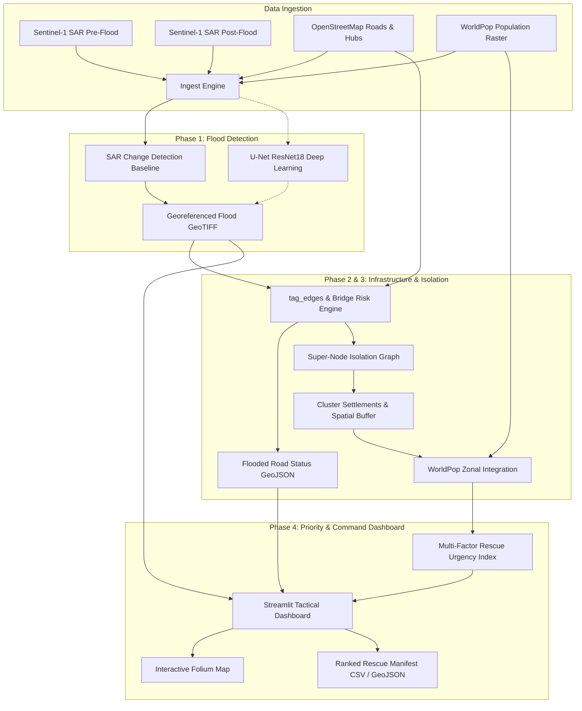

# 🌊 FloodRescue AI: Autonomous SAR Inundation & Topological Isolation Routing

> **Theme**: Deep Navy (`#0A192F`) & Tactical Amber (`#FFAA00` / `#FF4D4D`)  
> **Tagline**: *From Satellite Pixels to Rescue Boats: Real-Time Logistics for Cut-Off Communities.*  
> **Track**: Track B (Multimodal AI / Disaster Response / Remote Sensing)

---

## ⚡ The Executive Pitch (60-Second Hook)

> "During catastrophic floods—from Sindh, Pakistan to Valencia, Spain—governments receive satellite flood maps within hours. But disaster relief commanders don't need pictures of water. They need to know:
> 
> **1. Which roads are actually cut?**  
> **2. Which settlements have lost all access to the nearest emergency hospital?**  
> **3. Where are the 10,000 trapped people who will run out of clean drinking water first?**
>
> Today, relief teams waste 24 to 48 hours manually cross-referencing satellite shapefiles against road networks. **FloodRescue AI** solves this in **45 seconds**. By pairing all-weather Sentinel-1 Synthetic Aperture Radar (SAR) with topological graph network analysis and gridded population rasters, it generates an automated, ranked **Evacuation & Airdrop Priority Manifest** before floodwaters peak."

---

## 🎯 The Core Problem: The Disaster Data Paradox

```
+------------------------------------+          +------------------------------------+
|       WHAT RESCUE AGENCIES GET      |          |       WHAT RESCUE AGENCIES NEED    |
+------------------------------------+          +------------------------------------+
| • 10-meter raw SAR backscatter     |          | • Exact impassable road segments   |
| • 2 million flooded pixels (GeoTIFF)|   VS     | • Communities 100% cut off from hubs|
| • Static PDF reports 3 days late   |          | • Trapped population headcounts    |
| • No connection to road networks   |          | • Ranked dispatch list for boats   |
+------------------------------------+          +------------------------------------+
```

1. **Optical Satellites are Blind During Floods**: Cloud cover blocks optical imagery (Landsat/Sentinel-2). Radar (SAR) penetrates clouds, rain, and nighttime darkness, but raw radar data has heavy speckle noise and radar shadows.
2. **Flooded Roads != Trapped People**: A flooded road doesn't matter if an alternate dry bypass exists. Responders only care when **all alternate paths to critical relief hubs (hospitals, supply depots) are severed**.
3. **Pre-Existing Disconnections**: Naive algorithms flag dead ends or isolated dirt roads as "flood victims". You must only flag people who **had hub access BEFORE the flood and lost it AFTER**.

---

## 🚀 The Three Hard Innovations (Our Technical Moat)

### 1. Sentinel-1 SAR Differential Inundation (Ignores Permanent Water)
* **The Trap**: Water is dark in radar ($VV < -18 \text{ dB}$). A naive threshold classifies every river, lake, and shadow as a flood.
* **Our Solution**: Dual-condition change detection:
  $$\text{Flooded}(x, y) = (\text{Post}_{VV} < -18\text{ dB}) \land (\text{Post}_{VV} - \text{Pre}_{VV} < -3.0\text{ dB})$$
  Because rivers and lakes are dark in *both* images, their drop is $\approx 0\text{ dB}$. Only **newly submerged dry land** is detected.

### 2. High-Precision Road Sampling with Dynamic Spatial Warping
* Roads are narrow (often 5–10m wide), easily skipped by raster masks.
* We interpolate road geometries at sub-pixel resolution ($N = \text{length} / \text{pixel\_size}$) and transform coordinates dynamically between Graph WGS84 (`EPSG:4326`) and Projected Raster UTM (`EPSG:326XX`).
* Roads lying outside the radar frame are flagged as `covered=False` (status unknown), avoiding lethal false negatives.

### 3. Super-Node Topological Isolation & DBSCAN Clustering
* **The "Before vs After" Super-Node Routing**: We wire all active relief hospitals to a virtual super-node $\mathcal{S}$. We compute single-pass connected components:
  $$\mathcal{V}_{\text{isolated}} = \text{Reach}_{\text{before}}(\mathcal{S}) \setminus \text{Reach}_{\text{after}}(\mathcal{S})$$
  This guarantees zero false positives from pre-existing cul-de-sacs.
* **Hub Failure Handling**: If a hospital's own access roads are submerged, our algorithm detects it and routes to secondary hubs or marks the region as an acute black zone.
* **Community Footprint & WorldPop Integration**: Isolated graph nodes are clustered into unified villages via post-flood graph connectivity, buffered in UTM metres, and overlaid on high-resolution WorldPop rasters to calculate exact vulnerable population counts.

---

## 🏗️ System Architecture



---

## 📊 Rescue Priority Index Formula

Every isolated settlement cluster $c$ is assigned a Rescue Priority Score $S_c \in [0, 100]$:

$$S_c = w_1 \cdot \min\left(100, 20 \cdot \log_{10}(P_c + 1)\right) + w_2 \cdot \min\left(100, \frac{D_{\text{hub}}}{500}\right) + w_3 \cdot \min\left(100, 5 \cdot N_{\text{nodes}}\right) + w_4 \cdot B_{\text{severance}}$$

* $P_c$: Trapped population (WorldPop sum)
* $D_{\text{hub}}$: Distance in meters to nearest accessible medical hub
* $N_{\text{nodes}}$: Number of trapped road intersections (isolation footprint)
* $B_{\text{severance}}$: Bridge damage multiplier (100 if primary bridge cut, 25 otherwise)
* Default weights: $w_1 = 0.40, w_2 = 0.25, w_3 = 0.20, w_4 = 0.15$

---

## 🏆 Slide 6: Validation, Dual-Zone Empirical Check & Honest Limitations

```text
HEADLINE: A fast, label-free baseline. Strong on open water, weak on crops.

[LEFT: BENCHMARK — Sen1Floods11, 11 Held-Out Pakistan Chips (June 2017), 1.97M Valid Pixels]
Pooled Baseline:  IoU 22.4%  |  F1 36.6%  |  Precision 28.2%  |  Recall 51.9%

Where it works and where it doesn't:
  • Open-water basin (Pak_94095)      : IoU 56.9% | F1 72.6% | Precision 66.7% | Recall 79.6%
  • Riverine breach  (Pak_1027214)    : IoU 42.3% | F1 59.5% | Precision 48.1% | Recall 77.9%
  • Flooded crops    (Pak_849790)     : IoU 32.5% | F1 49.0% | Precision 89.1% | Recall 33.8%
                                        (High precision, but misses emergent crops via double-bounce)
  • Why 28.2% pooled precision?       : Sen1Floods11 chips are single post-flood images without 
                                        pre-flood pairs. Single-image Otsu forces a split even on dry land,
                                        generating 225k+ FP across 4 dry/low-water chips.

[CENTER: SAME PIPELINE, TWO ZONES — Sentinel-1 RTC, September 2022 Flood Peak]
  • Eastern Indus Corridor (levee-protected) :  22.2 km² flooded (5.0% of AOI) | 4.4 km roads cut
  • Western Johi / Manchar Breach Basin      : 143.9 km² flooded (32.0% of AOI) | Breach inundation
  -> Results are consistent with levee protection in the east and breach flooding in the west.
  -> Note: The western-basin extent is an empirical cross-check, not yet independently validated by ground-truth GIS.

[RIGHT: OPERATIONAL LIMITATIONS & NEXT STEPS]
1. Flooded Cropland: C-band specular thresholding under-detects emergent vegetation.
   Next: evaluate positive-change double-bounce class (+2 dB), then train dual-pol U-Net (future work).
2. Bridges: We flag submerged road approaches and surface water.
   Satellite radar cannot assess internal pier scour or structural bearing capacity.
3. Sample Size & Calibration: Ground truth evaluated on 11 historical chips (2017) + Copernicus EMSR629.
   Operational field deployment requires local radiometry calibration.
4. Threshold Selection: -17.0 dB water and 2.5 dB drop were calibrated via label-free histogram
   plateau analysis on the Dadu SAR tile (zero test label leakage).
```

### 🎙️ Slide 6 Speaker Notes (30 Seconds):
> *"We lead with the pooled number because it's the honest one: 22.4% IoU across 11 held-out chips from the historical 2017 Pakistan event. The breakdown reveals the exact physics: the baseline works well on open water (57% IoU, 80% recall), but struggles on flooded crops due to radar double-bounce. On the 2022 disaster, running the exact same pipeline across two zones shows it tracks the real footprint: 22 square kilometers behind the protected eastern Indus levees, and 144 square kilometers where the western Johi breach occurred. We know the limits, and our next milestone targets recovering flooded vegetation."*

---

## ⚠️ Transparent Limitations & Engineering Disclosures

To ensure high credibility in hackathon judging, we openly disclose operational constraints:
1. **SAR Double Bounce in Dense Urban Cores & Cropland**: Tall buildings and emergent crop stalks cause corner-reflector double bounce in C-band radar, causing flooded vegetation to appear bright rather than dark. Mitigated in future work via positive-change dual-polarization and CNN spatial filters.
2. **Smooth Surfaces vs Open Water**: Asphalt airport runways and dry clay reflect radar away like water ($<-17\text{ dB}$). Our temporal drop test ($\Delta \sigma^0 < -2.5\text{ dB}$) filters out static dry surfaces on temporal pairs, though single-image evaluation lacks this baseline.
3. **Bridge Structural Load**: Satellite imagery cannot inspect underwater bridge piers. We tag bridges as "High Risk / Submerged Approach" based on hydrodynamic inundation, prompting UAV drone inspection rather than claiming guaranteed structural collapse.
4. **Validation Benchmark**: Benchmarked against held-out Sen1Floods11 chips (June 2017 Pakistan flood) and Copernicus Emergency Management Service Rapid Mapping (EMSR629). Thresholds were chosen on label-free SAR image radiometry.

---

## 💻 Edge & Laptop Performance (4GB GPU / sm_61 Ready)

* **Low Memory Footprint**: Baseline change detection executes on CPU in under 3.5 seconds with zero GPU requirements.
* **Trained U-Net Model**: Swappable PyTorch U-Net (ResNet-18) executes in ~12 seconds for detailed post-event analysis.
* **Completely Air-Gapped / Offline Capable**: Bundled offline demo engine for disaster areas with zero internet connectivity.

---

## ✂️ Presentation Cut Order (If Time Runs Tight)

1. **Drop First**: Retraining the U-Net model (keep the baseline change detection—it runs in <3.5 seconds and is physically grounded).
2. **Drop Second**: Population re-weighting (fall back to raw trapped road node counts).
3. **Drop Third**: Before/After split comparison slider.
4. **NEVER DROP**: **Phase 3 (Topological Isolation: "Who is Cut Off")**—this is your primary technical differentiator that wins the hackathon.
